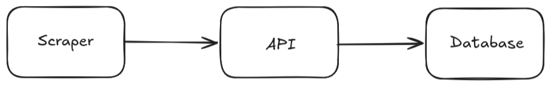
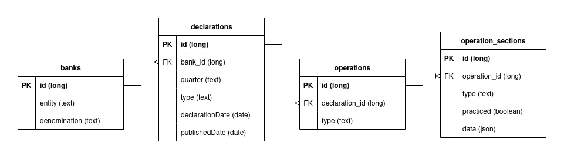
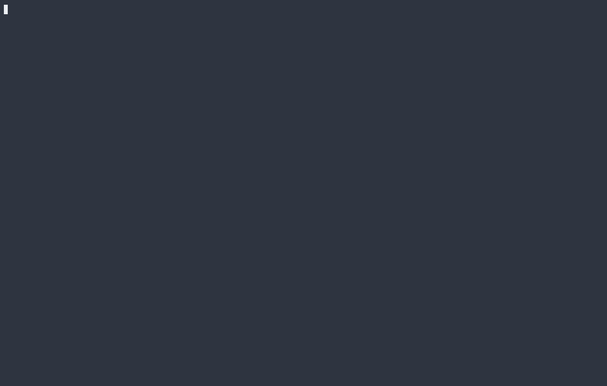
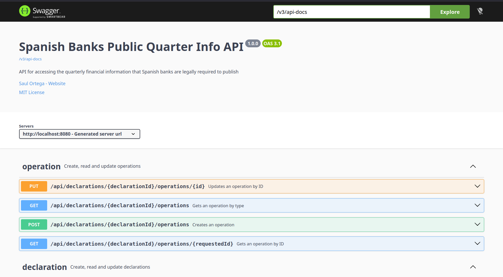

# 🏦 Spanish Banks Public Quarter Info

Spanish banks are legally required to publish their quarterly financial information to the Bank of Spain. This project **automates** the extraction of that data via a **web scraper** that navigates to the Bank of Spain's public portal, and stores the results in a PostgreSQL database through a **Spring Boot REST API**.

## 🔄 Workflow

<div align="center">
    
</div>

## 🛠️ Stack

[](#)
[](#)
[](#)
[](#)
[](#)
[](#)
[](#)

[](#)
[](#)
[](#)

## 🏗️ Project Structure
```
.
├── api/
│   ├── docker-compose.yml      # PostgreSQL and Spring Boot services
│   ├── Dockerfile
│   ├── mvnw
│   ├── mvnw.cmd
│   ├── pom.xml
│   └── src/
├── LICENSE
├── readme-assets/              # Assets used by the README
├── README.md
└── scraper/
    ├── main.ts                 # Entry point
    ├── package.json
    ├── pnpm-lock.yaml
    ├── pnpm-workspace.yaml
    ├── services/               # API operations
    └── types/                  # Interfaces

```

### 📁 Api Structure Example

```
bank/
├── BankController.java     # REST Endpoints
├── Bank.java               # Entity
├── BankRepository.java     # DB Access
└── BankService.java        # Business Logic
```

## 🔗 Relational Model

<div align="center">
    
</div>

## ▶️ API Installation

1. Navigate to the api folder
    ```bash
      cd api
    ```

2. Run the container with the api and the database
    ```bash
      docker compose up
    ```

### API Demo



## ▶️ Scraper Installation

1. Open a new terminal and navigate to the scraper folder
    ```bash
      cd scraper
    ```

2. Install the dependencies
    ```bash
      pnpm install
    ```

3. Run the scraper
    ```bash
      pnpm start
    ```

### Scraper Demo


## 📋 OpenAPI / Swagger Documentation

Once the container is running, you can navigate to the API documentation.

```bash
  http://localhost:8080/swagger-ui/index.html
```

<div align="center">
    
</div>

## 🎯 Future Improvements

- Add JSON Web Token.
- Improve validations to API endpoints.
- Persist scraper logs in a file.
- Implement CI/CD with Github Actions.

## ⚖️ License

This project is licensed under the [MIT License](LICENSE).